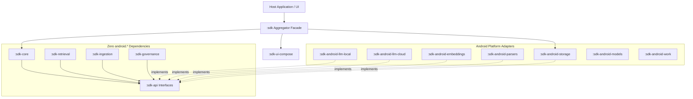
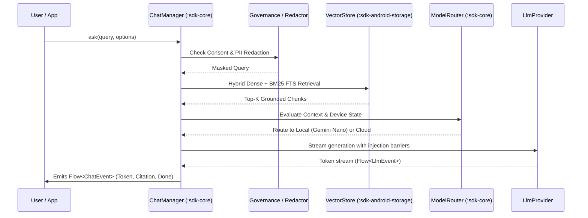

# RagChat Android SDK Architecture Guide

Enterprise-grade on-device RAG framework engineered with clean architecture, strict module boundaries, zero-PII logging, and pluggable Service Provider Interfaces (SPI).

---

## 1. High-Level Architecture Overview

---

## 2. Module Responsibilities & Boundary Rules

| Module Group | Modules | Rules & Guarantees |
| :--- | :--- | :--- |
| **Pure JVM Domain** | `:sdk-api`, `:sdk-core`, `:sdk-retrieval`, `:sdk-ingestion`, `:sdk-governance` | **Zero `android.*` imports**. Enforced via ArchUnit and CI checks. Fully testable via standard JVM unit tests. |
| **Android Platform** | `:sdk-android-storage`, `:sdk-android-embeddings`, `:sdk-android-llm-local`, `:sdk-android-llm-cloud`, `:sdk-android-parsers`, `:sdk-android-models`, `:sdk-android-work` | Hardware acceleration (GPU/NPU delegates), Android Keystore, SQLCipher, AICore Gemini Nano, OkHttp/SSE. |
| **User Interface** | `:sdk-ui-compose` | Material 3 Compose components, themeable tokens (`RagChatTheme`), TalkBack accessibility, localization (`en`, `hi`, `kn`, `ta`). |
| **Aggregator** | `:sdk` | Fluent DSL builder (`RagChat.builder`), secure defaults, convenience delegates. |

---

## 3. The RAG Query Pipeline

---

## 4. Concurrency & Memory Management
- **Reactive Streams**: 100% Kotlin Coroutines and `Flow`. No RxJava.
- **Dispatchers**: Compute-heavy tokenization and vector math execute strictly on `Dispatchers.Default`; file and database I/O execute on `Dispatchers.IO`.
- **Memory Pressure**: All model inference engines implement `ComponentCallbacks2.onTrimMemory` to release weights on system memory alerts.
