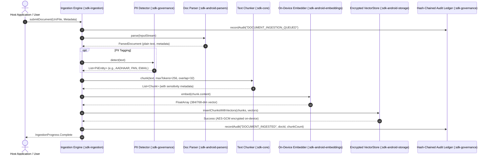
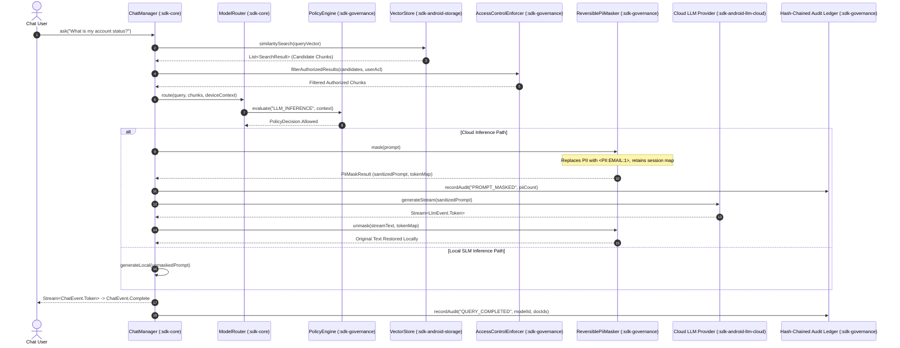
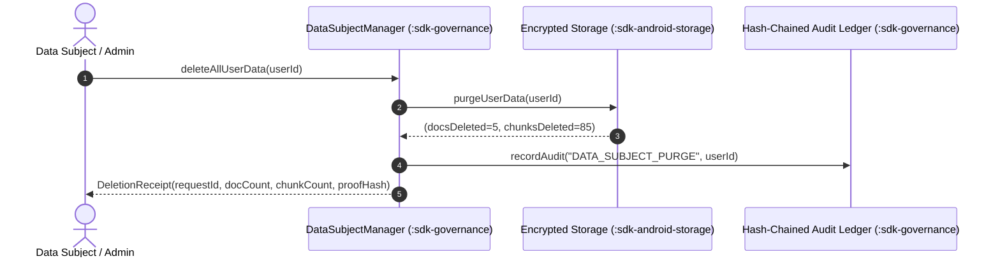

# RagChat Android SDK: Data Flow Architecture & Privacy Boundaries

This document provides architectural sequence diagrams demonstrating the lifecycle of user data, ingestion, and query routing across local device storage and external cloud LLM/Embedding boundaries.

---

## 1. Document Ingestion Pipeline

---

## 2. Query, Retrieval, Reversible Masking & Cloud Routing

---

## 3. Data Subject Deletion Flow (GDPR Art. 17 / DPDP Act)

